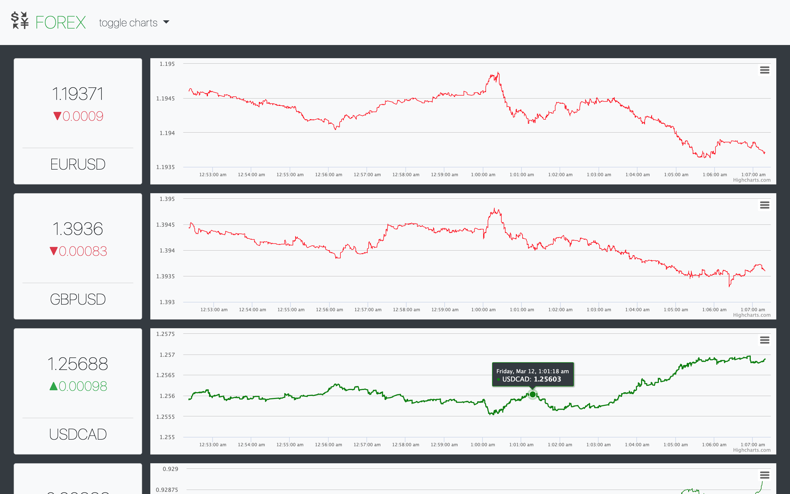

# Streaming Forex Data

### Flask, Bootstrap, HighCharts, & Bokeh to display live forex data



To deploy this to GCP:

  1. create a PostgreSQL instance through [Google Cloud Console](cloud.google.com)

    - create a db and enter the connection name, public ip address, name you gave the database, the port it's running on, the username, and the password in app.yaml. this creates environment variables for the app engine.

    - to create all the necessary tables, use flask_migrate. put the same db info into orm_config, or make all the same environment variables on your local machine and leave orm_config as is, then run the following commands:

```
$ export FLASK_APP=models.py
$ flask db init
$ flask db migrate
$ flask db upgrade
```

  2. create a compute engine instance in the same project as the PostgreSQL instance.

    - install python3, pip3, and tmux.

    - Install python packages:

     ```$ pip3 install flask, flask_sqlalchemy, python-dateutil, requests```

     - Acquire an API key thru forex.com and put the credentials in ~/.bashrc of the compute engine

     ```
     export cg_base=https://ciapi.cityindex.com/TradingAPI
     export cg_api=<your api creds>
     export cg_pword=<your api creds>
     export cg_uname=<your api creds>
     ```

     - ```$ mkdir scraper```

     - copy these files into the compute engine

      ```scp cg_scraper.py config.py market_dicts.py models.py <uname>@<compute IP>:~/scraper```

     - create a tmux session and run the scraper.

      ```$ tmux new -s scrape```

      ```$ cd scraper```

      ```$ python3 cg_scraper.py```


  3. deploy the application (gcloud sdk required)

    - set glcoud cli config to your project name

      ```$ gcloud config set project <your project name>```

      ```$ gcloud app deploy```
